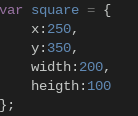

# eSharp Beta
A easy to use html canvas based helper tool/software/game engine. 
# New commands in development  

  
es.getMousePos(canvas, event);

  <ul>
    <li>
      <b>The code for the event </b> 
-----getMousePos(canvas, event) { 
---------var rect = canvas.getBoundingClientRect(); 
---------return { 
-------------x: event.clientX - rect.left; 
-------------y: event.clientY - rect.top; 
---------}; 
    }</li>
    <li>
      <b>A way to use it</b> 
       
      
    </li>  
  </ul>

 
 
<b>Main Commands</b>  

 
	
Commands

	 
	<ul>
    <li>es.random(maximum number);</li>
    <li>es.end();</li>
    <li>es.print("what is said"); </li>
    <li>es.rect(x,y,width,height,color,opacity);</li>
    <li>es.eclipse(x,y,radius,color,opacity);</li>
    <li>es.clear();</li>
    <li>es.background(color);</li>
    <li>es.image(image,x,y,width,height,opacity);</li>
    <li>es.checkCollisions(x,y,width,height,x1,y1,width1,height1);</li>
    <li>es.text("text",x,y,color,opacity);</li>
    <li>es.line(x,y,x1,y1,lineWidth,color,opacity);</li>
	</ul>

 
The Opacity selector is optional  
More things coming soon. 

