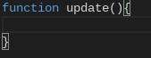

# eSharp Beta
A easy to use html canvas based helper tool/software/game engine. 
# New commands in development  

	
Added update function

	<ul>
		<li>Game and stuff now have a required update function</li>
		
		<li>This function runs 1 time every millisecond</li>
	</ul>

  
es.drawHitbox(x,y,w,h)

  <ul>
    <li>
      <b>The code for the event </b> 
drawHitbox(x,y,w,h) { 
----c.globalAlpha = 0.3; 
----c.fillStyle = "white"; 
----c.fillRect(x,y,w,h); 
----c.globalAlpha = 1;	     
}	    
 </li>  
  </ul>

 
 
<b>Main Commands</b>  

 
	
Commands

	 
	<ul>
    <li>es.random(maximum number);</li>
    <li>es.end();</li>
    <li>es.print("what is said"); </li>
    <li>es.rect(x,y,width,height,color,opacity);</li>
    <li>es.ellipse(x,y,radius,color,opacity);</li>
    <li>es.clear();</li>
    <li>es.background(color);</li>
    <li>es.image(image,x,y,width,height,opacity);</li>
    <li>es.checkCollisions(x,y,width,height,x1,y1,width1,height1);</li>
    <li>es.text("text",x,y,color,opacity);</li>
    <li>es.line(x,y,x1,y1,lineWidth,color,opacity);</li>
    <li>es.getMousePos(canvas,event);</li>
    <li>es.chooseRandom(op1,op2,op3,op4);</li>
	</ul>

 
The Opacity selector is optional  
More things coming soon. 

